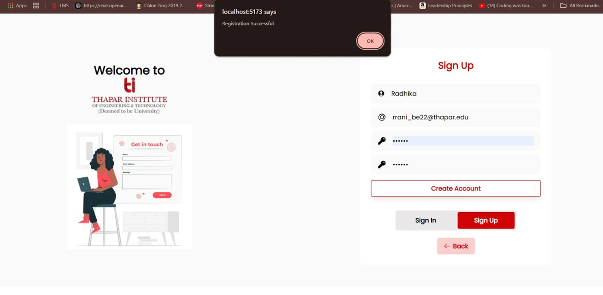
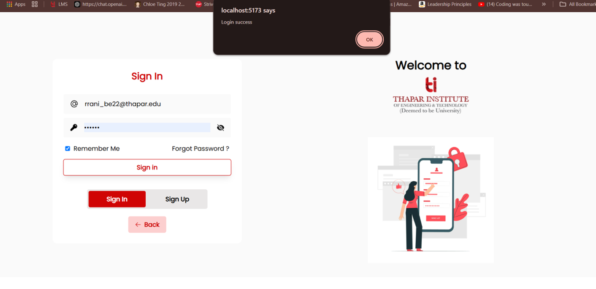
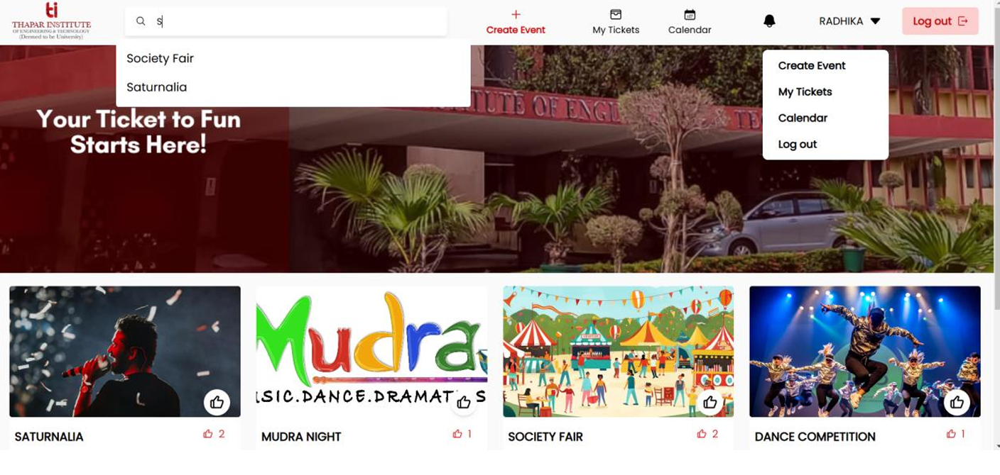
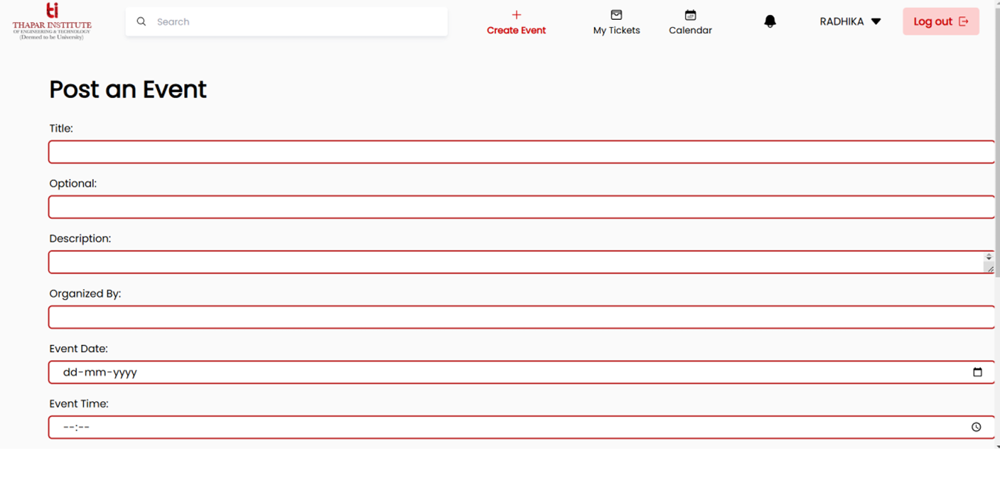
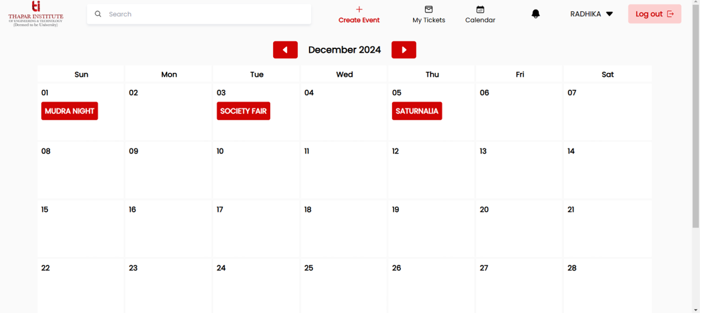
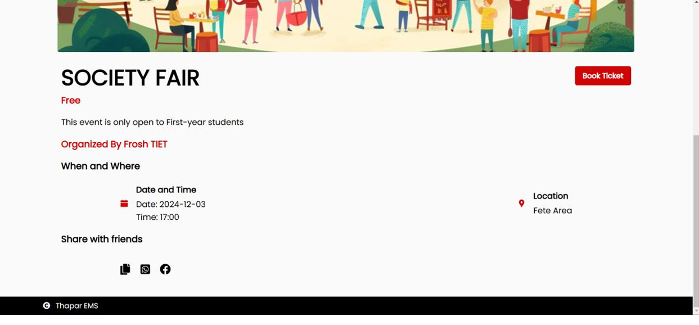
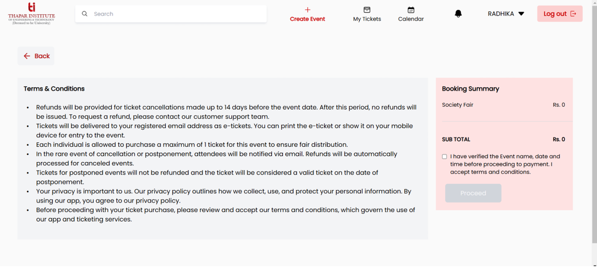
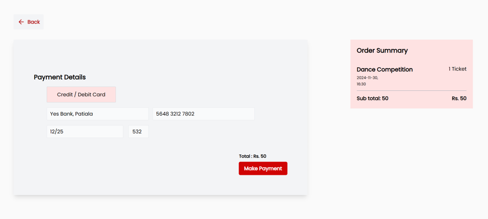
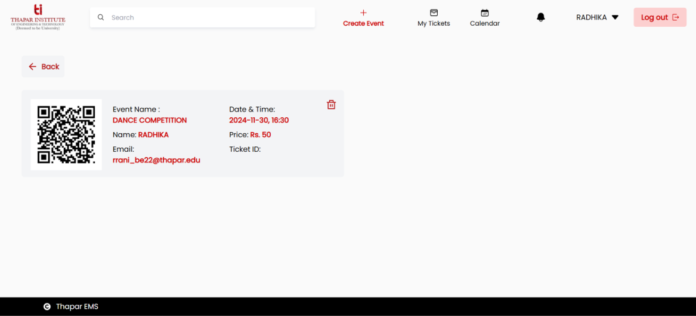

# Thapar Event Management System

Welcome to the **Thapar Event Management System (TEMS)**, a comprehensive platform designed to streamline event management and participation at Thapar University. This project aims to simplify the process of event organization, ticket booking, and event access for students, staff, and event organizers.

## Table of Contents
- [Introduction](#introduction)
- [Features](#features)
- [Technologies Used](#technologies-used)
- [Installation](#installation)
- [Usage](#usage)
- [Testing](#testing)
- [Contributors](#contributors)
- [Screenshots](#screenshots)

## Introduction
The **Thapar Event Management System** is a user-friendly web application developed to enhance the event experience at Thapar University. The platform allows users to browse events, book tickets, receive digital tickets with QR codes, and get personalized event recommendations. It also provides event organizers with tools to create, manage, and track events efficiently.

This project was inspired by the challenges faced during university events, such as long queues and manual ticketing processes. By digitizing the event management process, TEMS ensures a seamless and enjoyable experience for all users.

## Features
- **Instant Ticket Booking**: Quick and easy ticket reservation with a user-friendly interface.
- **Digital Tickets & QR Codes**: Secure and fast event entry using digital tickets and QR codes.
- **Personalized Recommendations**: Event suggestions based on user preferences and past activities.
- **Real-time Alerts & Reminders**: Notifications for upcoming events, ticket bookings, and important updates.
- **Event Management for Organizers**: Tools for creating, updating, and managing events, including ticket sales and attendee tracking.
- **Admin Dashboard**: Comprehensive dashboard for managing users, events, and platform settings.

## Technologies Used
- **Frontend**: HTML, CSS, JavaScript (React.js)
- **Backend**: Node.js with Express.js
- **Database**: MongoDB
- **Authentication**: JWT (JSON Web Tokens)
- **Payment Integration**: Secure payment gateways
- **Deployment**: Hosted on a Node.js runtime with MongoDB Atlas for database management

## Installation
To set up the Thapar Event Management System locally, follow these steps:

1. **Clone the Repository**:
   ```bash
   git clone https://github.com/your-username/thapar-event-management-system.git
   cd thapar-event-management-system
2. **Install Dependencies:**:
   ```bash
   npm install
3. **Set Up Environment Variables:**:
   ```bash
   PORT=3000
   MONGODB_URI=your_mongodb_connection_string
   JWT_SECRET=your_jwt_secret_key
4. **Run the backend:**:
   ```bash
   cd backend
   nodemon start
5. **Run the frontend:**:
   ```bash
   cd backend
   npm run dev
## Usage

### Students
- Log in to browse events, book tickets, and receive digital tickets with QR codes.

### Event Organizers
- Create and manage events, track attendees, and monitor ticket sales.

### Admins
- Oversee the platform, manage users, and ensure smooth operations.

## Testing

The project includes a comprehensive testing plan to ensure functionality, performance, and security. The following types of testing were conducted:

### Functional Testing
- Validating core functionalities like event creation, ticket booking, and payment processing.

### Usability Testing
- Ensuring a user-friendly interface and smooth navigation.

### Integration Testing
- Testing the interaction between frontend, backend, and database.

### Security Testing
- Validating user authentication and data privacy.

## Contributors

- [Radhika Rani](https://github.com/radhika-gh/) - GitHub
- [Swayam Aggarwal](https://github.com/Swayam0407/) - GitHub

  
## Screenshots

### 1. Sign Up Page


### 2. Sign In Page


### 3. Dashboard


### 4. Create Event Page


### 5. Calendar View Page


### 6. Event Details Page


### 7. Terms and Conditions Page


### 8. Payment Page


### 9. My Tickets Page

